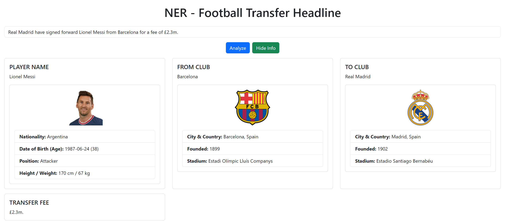

In this project, a spaCy Named Entity Recognition (NER) model is trained from scratch to identify key entities in football transfer headlines. The model is designed to recognize the following entities:
- Player Name
- Origin 
- Destination
- Transfer Type 
- Transfer Fee

The model is trained using synthetic transfer headlines as well as transfer headlines from real sport articles. 

The model is deployed on a html page that allows users to input a transfer headline and identify the entities.
Additionally, users can retrieve detailed information about the identified player and clubs. This information is fetched from the API-Football service.

